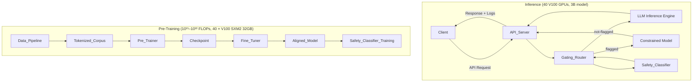
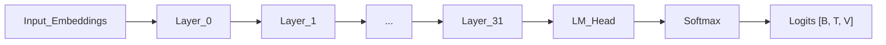
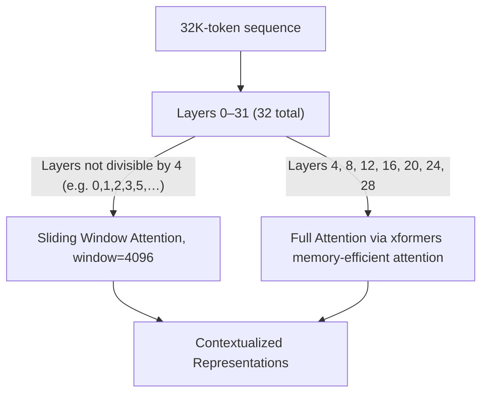
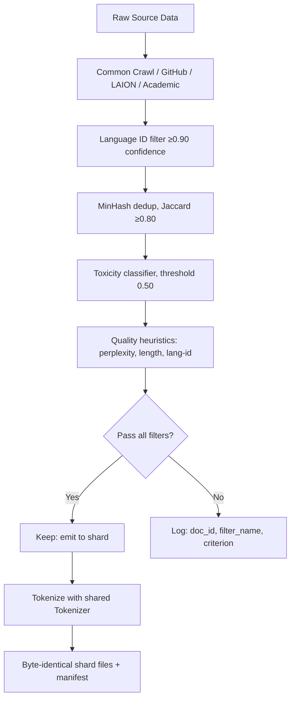

# Design Document: llm-3b-build

## Overview

This document describes the technical design for a ~3-billion-parameter multimodal autoregressive large language model (LLM) with a 32,768-token context window, targeting the **Param Ganga HPC cluster at IIT Roorkee**. The system spans five phases:

1. **Architecture** — Transformer decoder backbone with Mixture-of-Experts (MoE) FFN layers, long-context attention (sliding window + periodic full attention), and multimodal vision integration.
2. **Data** — Web-scale corpus collection, deduplication, toxicity filtering, and quality-controlled tokenization targeting 1–2 trillion tokens.
3. **Pre-Training** — Cross-entropy next-token prediction across 10²¹–10²² FLOPs, 40 V100 GPUs.
4. **Alignment** — Constitutional AI and RLHF fine-tuning with agentic reasoning capabilities.
5. **Safety & Deployment** — Safety classifier, inference-time gating router, red-teaming, and production API.

The design targets strong performance on language understanding, code reasoning, vision-language tasks, and safe agentic behavior, within the hard constraints of the Param Ganga V100 infrastructure.

---

## Hardware Constraints and Design Rationale

This section documents the V100-specific constraints that drove the adaptation of the original "10B on 1,000+ H100s" design to the Param Ganga cluster, and the explicit tradeoffs made.

### Param Ganga Cluster Specifications

| Resource | Value |
|---|---|
| Total nodes | 20 |
| GPUs per node | 2 × NVIDIA V100 SXM2 |
| Total GPUs | 40 |
| VRAM per GPU | 32 GB HBM2 |
| FP16 throughput | 125 TFLOPS/GPU; ~5,000 TFLOPS cluster-wide |
| Intra-node interconnect | NVLink (900 GB/s) |
| Inter-node interconnect | InfiniBand |
| CUDA Compute Capability | 7.0 |
| BF16 support | ❌ Not available on CC 7.0 |
| FlashAttention-2 support | ❌ Requires CC 8.0+ (Ampere) |
| FlashAttention-1 / xformers | ✅ Supported |

### V100 Hardware Limitations

1. **No BF16**: The V100 (CC 7.0) does not support the BF16 data type natively. All mixed-precision training must use FP16 with dynamic loss scaling. BF16's wider dynamic range (which reduces overflow/underflow risk) is unavailable; dynamic loss scaling compensates.

2. **No FlashAttention-2**: FlashAttention-2 requires CUDA CC 8.0 (Ampere) or later. The V100 supports FlashAttention-1 and xformers memory-efficient attention, both of which avoid materializing the full O(n²) attention matrix but are somewhat less optimized than FA-2.

3. **32 GB VRAM**: Limits per-GPU model slice size. With TP=2 and PP=4, each GPU holds 1/(2×4) = 1/8 of the model. A ~3B parameter model in FP16 occupies ~6 GB of weights per GPU shard, leaving room for activations and optimizer state under gradient checkpointing.

4. **Gradient checkpointing mandatory**: Without gradient checkpointing, activation memory at 32K context length would exceed 32 GB. Gradient checkpointing trades recomputation for memory and is required throughout all training phases.

5. **Cluster scale**: 40 GPUs total versus 1,000+ H100s in the original spec. This fundamentally changes the compute budget by ~3 orders of magnitude, requiring a proportionally smaller model and training duration.

### Original vs. Param Ganga-Adapted Specification

| Parameter | Original Spec | Param Ganga Spec | Rationale |
|---|---|---|---|
| Model parameters | ~10B | ~3B | Fits in 40 × 32 GB V100s with TP=2, PP=4 |
| Transformer layers | 96 | 32 | Scaled down proportionally |
| Hidden dimension | 4,096 | 2,560 | Reduces per-layer memory |
| Attention heads | 64–128 | 20 | Proportional to hidden_dim (128 per head) |
| FFN expansion | 4× | 4× | Unchanged |
| Context window | 1,000,000 tokens | 32,768 tokens | V100 memory budget; no YaRN needed |
| Attention mechanism | FlashAttention-2 | xformers / FlashAttention-1 | CC 7.0 limitation |
| Mixed precision | BF16 | FP16 + dynamic loss scaling | CC 7.0 limitation |
| MoE experts per layer | 256 | 64 | Memory budget per GPU |
| Top-k routing | 2 | 2 | Unchanged |
| Vision max patches | 1,024 | 256 | Proportional to context budget |
| Total GPUs | 1,000+ H100 | 40 V100 | Cluster constraint |
| Parallelism | TP=8, PP=8, DP=16 | TP=2, PP=4, DP=5 | Matches 40 GPU topology |
| Global batch tokens | 100M | 2M | Cluster size constraint |
| Target FLOPs | 10²³–10²⁴ | 10²¹–10²² | ~5,000 TFLOPS × 2–4 weeks |
| Checkpoint milestones | 1T, 5T tokens | 100B, 300B tokens | Scaled to 1–2T corpus |
| Total training corpus | 10–20T tokens | 1–2T tokens | Chinchilla-optimal for 3B |
| Safety classifier latency | ≤50ms | ≤200ms | V100 inference hardware |
| Gating router timeout | 100ms | 400ms | Accounts for V100 latency |

### Long-Context Strategy at 32K (Simplified vs. 1M)

At 32,768 tokens, the memory and compute requirements are dramatically lower than at 1M tokens. This enables a simpler attention strategy:

- **Sliding window attention** (window = 4,096) for all layers except every 4th.
- **Full attention** (via xformers memory-efficient attention) for every 4th layer — these global layers ensure cross-chunk coherence across the full 32K window.
- **RoPE with standard scaling**: RoPE generalizes well to 32K without needing YaRN interpolation (YaRN is designed for extreme extrapolation beyond 4–8× training length; 32K is a single training length here).
- **No hierarchical attention needed**: The O(n²) cost for 32K tokens with xformers is manageable on V100 for the periodic full-attention layers. Hierarchical compression would add complexity with no benefit at this scale.

---

## Architecture

### High-Level System Diagram



### Training Pipeline Diagram

```mermaid
flowchart LR
    Raw_Data --> Data_Pipeline
    Data_Pipeline -->|MinHash dedup + quality filter| Clean_Corpus
    Clean_Corpus --> Tokenizer
    Tokenizer -->|BPE/Unigram shards| Tokenized_Corpus
    Tokenized_Corpus --> Pre_Trainer
    Pre_Trainer -->|10²¹–10²² FLOPs, 40 × V100 SXM2, TP=2 PP=4 DP=5| Base_Model
    Base_Model --> Constitutional_AI
    Constitutional_AI --> SFT_Model
    SFT_Model --> RLHF
    RLHF --> Aligned_Model
    Aligned_Model --> Safety_Classifier_Training
    Aligned_Model --> Red_Team_Eval
    Red_Team_Eval --> API_Server
```



---

## Components and Interfaces

### 1. Transformer Decoder Backbone

The core model is an autoregressive Transformer decoder. Key design choices:

- **Depth**: 32 layers. With hidden_dim=2,560, 20 attention heads, and 64-expert MoE layers on alternating FFN layers, this reaches the ~3B parameter target.
- **Attention**: Multi-head self-attention with causal masking. **xformers memory-efficient attention** or **FlashAttention-1** is mandatory to avoid materializing the full O(n²) attention matrix. FlashAttention-2 is NOT used — it requires CUDA CC 8.0+ (Ampere) and is unsupported on V100 (CC 7.0).
- **Positional Encoding**: RoPE applied to queries and keys. Standard RoPE scaling is sufficient for the 32K context window without YaRN.
- **FFN Activation**: SwiGLU, which empirically outperforms GELU on language modeling at this scale.
- **No weight tying**: The input embedding matrix and the output projection (lm_head) are independent weight matrices.
- **Gradient checkpointing**: Mandatory throughout training. Recomputes activations on backward pass to reduce peak memory usage on 32 GB V100 HBM2.
- **Mixed precision**: FP16 with dynamic loss scaling. BF16 is unavailable on CC 7.0.
- **Output**: A softmax over the vocabulary producing a valid probability distribution.

**Interface**: `forward(input_ids: Tensor[B, T]) -> logits: Tensor[B, T, V]`



### 2. Mixture-of-Experts Feed-Forward Layers

Every alternate FFN layer (or a configurable fraction) is replaced with an MoE layer:

- **Experts**: 64 experts per MoE layer, each a standard SwiGLU FFN. Reduced from the original 256 to fit within the 32 GB V100 VRAM budget.
- **Router**: A learned linear layer (hidden_dim → num_experts) producing raw logit scores. Top-k selection with k=2 (fixed at config time). Softmax over the top-k scores produces combination weights.
- **Load Balancing**: Auxiliary loss `L_aux = α × Σ_i (f_i × P_i)` where `f_i` is the fraction of tokens routed to expert `i`, and `P_i` is the mean router probability for expert `i`. Weight `α` is configurable.
- **No Dropout**: Dropout is disabled within MoE layers.

**Interface**: `moe_forward(x: Tensor[B, T, D]) -> Tensor[B, T, D]`

### 3. Long-Context Attention (32K Tokens)

Supporting 32,768 tokens uses a hybrid attention strategy designed for V100 memory constraints:

- **Local attention (Sliding Window)**: Used in most layers (every layer that is not a global layer). Each token attends to a local window of size 4,096. This is memory-efficient and handles the majority of layers.
- **Global attention (Full, via xformers)**: Every 4th layer (layers 4, 8, 12, …, 28) uses full self-attention over the complete 32K sequence, implemented with xformers memory-efficient attention to avoid materializing the full attention matrix.
- **Position Extension**: Standard RoPE. At 32K tokens, no position interpolation tricks (YaRN, NTK-aware scaling) are needed — 32K is the training context length, not an extrapolation target.
- **No hierarchical attention**: At 32K (versus 1M), the O(n²) cost for periodic full-attention layers is acceptable with xformers. Hierarchical summary tokens are not needed and would add unnecessary complexity.
- **Causal masking invariant**: All attention mechanisms enforce strict causal masking — attention weight from position i to position j > i is exactly 0.0.



### 4. Vision Encoder

The Vision Encoder converts images into patch embeddings compatible with the text token embedding space:

- **Patch size**: 16×16 pixels (fixed).
- **Padding**: Images not divisible by 16 in either dimension are zero-padded to the nearest multiple of 16 before patch extraction.
- **Max patches**: 256 (reduced from 1,024 to fit within the 32K token context budget alongside text). Images producing ≥257 patches are rejected with a structured error.
- **Projection**: A learned linear layer maps each flattened patch (16×16×C channels) to the model's hidden dimension D=2,560.
- **2D Positional Encoding**: Learnable 2D positional embeddings (row × col) are added to each patch embedding, encoding spatial position.
- **Sequence ordering**: All image patch embeddings are prepended to text token embeddings before being fed into the shared Transformer layers.

**Interface**:
```
encode_image(image: Tensor[H, W, C]) -> patch_embeddings: Tensor[N_patches, D]
  raises: PatchLimitExceededError if N_patches > 256
```

### 5. Shared Subword Tokenizer

A single tokenizer handles all modalities:

- **Algorithm**: BPE (preferred for code/multilingual robustness) or Unigram. Trained on ≥100B tokens sampled from the pre-training corpus with no single modality exceeding 70%.
- **Vocabulary size**: 32,000–256,000 tokens. Target: ~128,000 to balance multilingual coverage and model overhead.
- **Byte-level fallback**: 256 reserved byte tokens (0x00–0xFF) guarantee lossless encoding of any valid UTF-8 byte sequence.
- **Round-trip property**: `decode(encode(s)) == s` for all valid UTF-8 strings not containing special control tokens.
- **Special tokens**: `<BOS>`, `<EOS>`, `<PAD>`, `<IMG_START>`, `<IMG_END>`, and per-domain special tokens.

**Interface**:
```
encode(text: str) -> List[int]
decode(token_ids: List[int]) -> str
```

### 6. Data Pipeline



Target: 1–2 trillion tokens across all text modalities before deduplication. The same MinHash deduplication, toxicity filtering, and quality heuristics apply. The smaller corpus target (versus the original 10–20T) is Chinchilla-optimal for a ~3B parameter model.

### 7. Pre-Trainer

- **Objective**: Cross-entropy NTP loss over all non-padding tokens.
- **Batch size**: 2,000,000 tokens/step (fixed in config before training).
- **Parallelism**: Tensor parallelism TP=2 (within each node via NVLink), Pipeline parallelism PP=4 (across 4 nodes via InfiniBand), Data parallelism DP=5 (5 replica groups × 8 GPUs each = 40 GPUs total).
- **Checkpointing**: At 100B tokens, 300B tokens, and training end. Retry-on-failure (up to 3 retries).
- **Gradient checkpointing**: Mandatory. Recomputes activations during backward pass to fit within 32 GB V100 HBM2.
- **Mixed precision**: FP16 with dynamic loss scaling. On overflow, reduce loss scale by 2× and skip the gradient update without halting.

### 8. Optimizer

- **AdamW**: β1=0.9, β2=0.95, ε=1×10⁻⁸, weight decay=0.1 (non-embedding, non-bias params only).
- **Learning rate**: Peak 1×10⁻⁴; linear warmup 2,000 steps (0 → peak); cosine decay from peak to 1×10⁻⁵.
- **Gradient clipping**: max norm = 1.0.

### 9. Fine-Tuner

Two sequential stages:

1. **Constitutional AI / SFT**: Fine-tune on 800M–1.2B curated QA/chat tokens. Peak LR ≤ 1×10⁻⁵.
2. **RLHF**: Reward model trained on ≥100K human preference pairs. PPO or DPO fine-tuning for ≤1% of pre-training gradient steps. Early stopping if reward drops below SFT baseline on held-out 5K-example set.

### 10. Safety Classifier

- **Architecture**: BERT-base encoder (≤110M params).
- **Binary classification**: `flagged` / `not-flagged`.
- **Latency**: ≤200ms on V100 inference hardware (relaxed from ≤50ms, reflecting V100 inference speed vs. H100).
- **Performance target**: Precision ≥0.90, Recall ≥0.85 on held-out set of ≥2,000 examples (≥30% positive).
- **Retraining**: Triggered by ≥500 new labeled examples; LLM weights unchanged; must re-meet P/R thresholds.

### 11. Gating Router

```mermaid
sequenceDiagram
    participant Client
    participant Gating_Router
    participant Safety_Classifier
    participant LLM["LLM (3B, V100)"]
    participant Constrained

    Client->>Gating_Router: API Request
    Gating_Router->>Safety_Classifier: classify(prompt)
    alt classifier returns result within 400ms
        Safety_Classifier-->>Gating_Router: flagged / not-flagged
        alt not-flagged
            Gating_Router->>LLM: forward request
            LLM-->>Gating_Router: response
        else flagged
            Gating_Router->>Constrained: forward request
            Constrained-->>Gating_Router: constrained response
        end
    else timeout (>400ms) or error
        Gating_Router->>Constrained: treat as flagged, forward
        Constrained-->>Gating_Router: constrained response
    end
    Gating_Router-->>Client: response
```

Timeout threshold is 400ms (not 100ms), reflecting V100 inference latency for the Safety Classifier.

### 12. API Server

- **Versioned REST API**: `/v1/completions`, `/v1/chat`, `/v1/agentic` endpoints.
- **Inputs**: Text (required), image (optional).
- **Outputs**: Text.
- **Logging**: All requests/responses with payload, timestamp, endpoint ID, client ID. 30-day mandatory retention.
- **Temperature**: Fixed per API version config; no runtime dynamic adjustment.
- **Planning mode**: Enabled by default on agentic endpoints.
- **Monitoring**: Alert ops team within 1 hour if flagging rate rises ≥50% vs. first-7-day baseline and is sustained ≥1 hour over any rolling 7-day window.

---

## Data Models

### ModelConfig

```python
@dataclass
class ModelConfig:
    num_layers: int                   # 32
    hidden_dim: int                   # 2_560
    num_attention_heads: int          # 20
    ffn_expansion_ratio: float        # 4.0 (≥4.0 required)
    vocab_size: int                   # 32_000–256_000
    max_seq_len: int                  # 32_768
    positional_encoding: str          # "rope" | "alibi"
    ffn_activation: str               # "swiglu" | "gelu"
    use_weight_tying: bool            # must be False
    attention_backend: str            # "xformers" | "flash_attn_v1"
                                      # NOTE: "flash_attn_v2" is NOT supported on V100 (CC 7.0)
    use_gradient_checkpointing: bool  # must be True (mandatory on 32 GB V100)
    moe_config: Optional[MoEConfig]
    vision_config: Optional[VisionConfig]
```

### MoEConfig

```python
@dataclass
class MoEConfig:
    num_experts: int               # 64
    top_k: int                     # 2 (1 ≤ k ≤ num_experts)
    load_balance_alpha: float      # auxiliary loss weight (configurable)
    load_balance_tolerance: float  # max deviation from 1/N (configurable)
    dropout: float                 # must be 0.0
```

### VisionConfig

```python
@dataclass
class VisionConfig:
    patch_size: int              # must be 16
    max_patches: int             # 256
    hidden_dim: int              # must match ModelConfig.hidden_dim (2_560)
    use_2d_pos_encoding: bool    # must be True
```

### TokenizerConfig

```python
@dataclass
class TokenizerConfig:
    algorithm: str               # "bpe" | "unigram"
    vocab_size: int              # 32_000–256_000
    byte_level_fallback: bool    # must be True
    special_tokens: List[str]    # BOS, EOS, PAD, IMG_START, IMG_END, ...
```

### TrainingConfig

```python
@dataclass
class TrainingConfig:
    global_batch_tokens: int     # 2_000_000 (fixed before run)
    target_flops_min: float      # 1e21
    target_flops_max: float      # 1e22
    num_gpus: int                # 40
    tensor_parallel: int         # 2 (NVLink within node; 2 GPUs/node)
    pipeline_parallel: int       # 4 (InfiniBand across 4 nodes)
    data_parallel: int           # 5 (5 replica groups × 8 GPUs = 40 GPUs)
    # Mixed precision — BF16 unavailable on V100 (CC 7.0); FP16 + loss scaling required
    use_fp16: bool               # True
    use_loss_scaling: bool       # True (dynamic loss scaling required for FP16)
    # AdamW
    beta1: float                 # 0.9
    beta2: float                 # 0.95
    epsilon: float               # 1e-8
    weight_decay: float          # 0.1
    # LR schedule
    peak_lr: float               # 1e-4
    final_lr: float              # 1e-5
    warmup_steps: int            # 2000
    grad_clip_norm: float        # 1.0
    # Checkpoint milestones (in tokens)
    checkpoint_milestones: List[int]  # [100_000_000_000, 300_000_000_000]
    checkpoint_retry_limit: int       # 3
```

### DataPipelineConfig

```python
@dataclass
class DataPipelineConfig:
    minhash_jaccard_threshold: float     # ≥0.80
    toxicity_threshold: float            # default 0.50 (configurable)
    perplexity_percentile_cutoff: float  # 95th percentile
    min_doc_length_chars: int            # 50
    max_doc_length_chars: int            # 1_000_000
    lang_id_min_confidence: float        # 0.90
```

### Checkpoint

```python
@dataclass
class Checkpoint:
    model_weights: Dict[str, Tensor]
    optimizer_state: Dict[str, Any]
    total_tokens_processed: int
    training_step: int
    timestamp: datetime
```

### APIRequest

```python
@dataclass
class APIRequest:
    request_id: str
    client_id: str
    endpoint: str                # "/v1/completions" | "/v1/chat" | "/v1/agentic"
    text_prompt: str
    image: Optional[bytes]       # raw image bytes, optional
    api_version: str
    timestamp: datetime
```

### APIResponse

```python
@dataclass
class APIResponse:
    request_id: str
    output_text: str
    routed_to: str               # "unconstrained" | "constrained"
    classifier_result: str       # "flagged" | "not-flagged" | "timeout"
    latency_ms: float
    timestamp: datetime
```

### SafetyClassifierResult

```python
@dataclass
class SafetyClassifierResult:
    label: str                   # "flagged" | "not-flagged"
    confidence: float            # [0.0, 1.0]
    latency_ms: float
    error: Optional[str]         # populated on failure
```

---

## Correctness Properties

*A property is a characteristic or behavior that should hold true across all valid executions of a system — essentially, a formal statement about what the system should do. Properties serve as the bridge between human-readable specifications and machine-verifiable correctness guarantees.*

---

### Reflection: Redundancy Elimination

Before listing final properties, redundancy was eliminated:

- **1.7 (output probability distribution) + 8.1 (NTP loss)**: Both relate to forward pass correctness. The output distribution property (1.7) is kept as a direct invariant on the model output; the NTP loss property (8.1) is kept separately because it validates the training loss computation logic, not just the output.
- **12.5, 13.1, 13.2, 13.3, 13.5 (routing properties)**: These all concern the Gating_Router. They are consolidated into one property covering the classify-then-route invariant for normal operation and failure-mode fallback.
- **4.1 and 4.2**: Patch tiling and projection dimension are independent structural properties. Both are kept.
- **4.3 and 4.4**: Positional encoding uniqueness and ordering of embeddings are independent and kept separately.
- **7.1 (MinHash) and 7.2 (toxicity) and 7.3 (quality heuristics)**: Each tests a different filter, so all are kept.
- **5.2 (lossless encoding) is subsumed by 5.3 (round-trip)**: Only 5.3 is kept.
- **11.2 and 11.3**: Both test output structure properties of the agentic model. They test different aspects (intermediate steps vs. planning decomposition) and are kept separately.

After reflection, 15 properties remain, each providing unique validation value.

---

### Property 1: Output Probability Distribution Validity

*For any* valid input token sequence (any length up to 32,768 tokens, any content within the vocabulary), the model's output at every token position shall be a valid probability distribution: all values in [0.0, 1.0] and summing to 1.0 ± 1×10⁻⁵ floating-point tolerance.

**Validates: Requirements 1.7**

---

### Property 2: MoE Top-k Routing Exactness

*For any* token processed by any MoE layer, in any batch of any size, exactly k=2 experts (fixed in the architecture config) shall be activated and shall contribute to the output — no more, no fewer.

**Validates: Requirements 2.2**

---

### Property 3: MoE Weighted Combination Correctness

*For any* input tensor processed by an MoE layer, the layer's output shall equal the weighted sum of exactly k=2 selected expert outputs, where the weights are the normalized (softmax over top-k) router scores for that token.

**Validates: Requirements 2.3**

---

### Property 4: Load Balancing Loss Activation

*For any* training batch in which any single expert's token fraction deviates from 1/64 by more than the configured tolerance threshold, the auxiliary load-balancing loss L_aux shall be strictly positive (non-zero). Conversely, for any batch in which all expert token fractions are within the tolerance of 1/64, the load-balancing loss contribution shall be near zero (below a small epsilon proportional to tolerance).

**Validates: Requirements 2.5**

---

### Property 5: Strict Causal Masking

*For any* input sequence of any length up to 32,768 tokens, and for every layer and every attention head, the attention weight from any position i to any position j where j > i shall be exactly 0.0, verifiable by inspecting the attention weight matrix.

**Validates: Requirements 3.6**

---

### Property 6: Vision Encoder Patch Tiling

*For any* input image of any valid dimensions (after padding to the nearest multiple of 16 in each dimension), the Vision Encoder shall produce exactly ⌈H/16⌉ × ⌈W/16⌉ non-overlapping patches that tile the full padded image, with no pixel belonging to more than one patch and no pixel excluded.

**Validates: Requirements 4.1, 4.6**

---

### Property 7: Vision Patch Embedding Dimension Consistency

*For any* input image of any valid dimensions, every patch embedding produced by the Vision Encoder shall have exactly the same dimensionality as the text token embeddings (i.e., equal to the model's hidden dimension D=2,560).

**Validates: Requirements 4.2**

---

### Property 8: Image Patch Sequence Ordering

*For any* multimodal input containing at least one image and at least one text token, the combined input sequence fed to the shared Transformer shall contain all image patch embeddings before any text token embeddings, with no text token appearing at a position index less than or equal to the last image patch position index.

**Validates: Requirements 4.4**

---

### Property 9: Tokenizer Round-Trip Fidelity

*For any* valid UTF-8 string that does not contain special control tokens, applying the tokenizer's encode function followed by the decode function shall return a string byte-identical to the original input: `decode(encode(s)) == s`.

**Validates: Requirements 5.2, 5.3**

---

### Property 10: Byte-Level Fallback Completeness

*For any* byte sequence (including byte patterns not covered by vocabulary tokens), the tokenizer's encode function shall complete without raising an error, using byte-level fallback tokens as needed, such that `decode(encode(bytes))` recovers the original byte sequence.

**Validates: Requirements 5.5**

---

### Property 11: Deduplication Near-Duplicate Removal

*For any* pair of documents with Jaccard similarity ≥ 0.80, the Data Pipeline shall retain at most one copy of those documents in the output corpus. For any pair of documents with Jaccard similarity < 0.80, both documents shall be retained (subject to other filters passing).

**Validates: Requirements 7.1**

---

### Property 12: Quality Filter Coverage

*For any* document that fails any one of the three quality heuristics — (a) perplexity exceeds the 95th-percentile threshold, (b) character length < 50 or > 1,000,000, or (c) language-id confidence < 0.90 — the Data Pipeline shall exclude that document from the training corpus. Any document passing all three heuristics shall not be excluded by the quality filter alone.

**Validates: Requirements 7.3**

---

### Property 13: Filter Rejection Log Completeness

*For any* document excluded by any filter (toxicity, deduplication, or quality heuristics), the Data Pipeline shall emit exactly one log entry for that document containing: the document identifier, the name of the filter that excluded it, and the specific criterion violated — with no missing fields.

**Validates: Requirements 7.2, 7.4**

---

### Property 14: Gating Router Correct Routing

*For any* incoming API request, the Gating Router shall: (a) invoke the Safety Classifier before forwarding the request to any model; (b) forward to the unconstrained LLM if and only if the classifier returns not-flagged within 400ms without error; (c) forward to the constrained model if the classifier returns flagged, times out (>400ms), or returns an error — ensuring classifier failure never results in an unsafe request reaching the unconstrained LLM.

**Validates: Requirements 12.5, 13.1, 13.2, 13.3, 13.5**

---

### Property 15: Agentic Output Intermediate Steps

*For any* multi-step task prompt that requires at least two distinct reasoning steps, the model output (with planning mode active) shall contain at least two distinct intermediate reasoning steps appearing before the final answer, without requiring explicit chain-of-thought instructions in the prompt.

**Validates: Requirements 11.2, 11.3**

---

## Error Handling

### Model / Inference Errors

| Condition | Behavior |
|---|---|
| Input sequence > 32,768 tokens | Reject with structured error: `{"error": "sequence_too_long", "max_tokens": 32768, "provided_tokens": N}` |
| Image produces > 256 patches | Reject with `{"error": "patch_limit_exceeded", "max_patches": 256, "produced_patches": N}` |
| Safety Classifier timeout (>400ms) or error | Treat as flagged; route to constrained model; log classifier failure with timestamp |
| Checkpoint save failure | Retry up to 3 times with exponential backoff; after 3 failures, halt training and emit error with failure reason; never silently continue |
| Tokenizer encounters un-encodable byte | Use byte-level fallback (reserved 0x00–0xFF tokens); never raise an error for valid UTF-8 input |
| GPU OOM during training | Halt training step, log device/step info, do NOT silently skip the step |
| FP16 loss scale overflow | Reduce loss scale by 2× and skip the current gradient update; continue training without halting |

### Data Pipeline Errors

| Condition | Behavior |
|---|---|
| Document fails any filter | Log: `{doc_id, filter_name, criterion_violated}` and exclude from corpus |
| Shard write failure | Fail loudly; do not produce partial shards; retry with configurable attempts |
| Tokenization failure on document | Log error with doc_id; skip document; continue pipeline |
| MinHash signature computation failure | Log error; skip dedup for that document (conservative: treat as not-duplicate) |

### Fine-Tuning Errors

| Condition | Behavior |
|---|---|
| Avg reward drops below SFT baseline | Halt training immediately; restore checkpoint with highest observed reward; log the triggering evaluation score |
| RLHF reward model training failure | Halt fine-tuning; emit error with failure reason |

### API / Monitoring Errors

| Condition | Behavior |
|---|---|
| Flagging rate rises ≥50% vs. baseline for ≥1hr | Alert ops team within 1 hour of condition being first satisfied |
| Safety Classifier retraining fails to meet P/R thresholds | Do not deploy retrained classifier; keep current production classifier; alert ML team |
| Log write failure | Retry; if persistent, alert ops team; do not drop logs silently |

---

## Testing Strategy

### Dual Testing Approach

Both unit/example-based tests and property-based tests are required. Unit tests cover specific examples, boundary conditions, and error handling. Property tests provide universal coverage across the input space by running each property a minimum of 100 iterations with randomly generated inputs.

### Property-Based Testing Library

- **Python** (primary): [`hypothesis`](https://hypothesis.readthedocs.io/) — mature PBT library with excellent NumPy/PyTorch integration and deterministic shrinking.
- Each property test must run a minimum of **100 iterations** (Hypothesis: `@settings(max_examples=100)`).
- Each property test must include a comment tag: `# Feature: llm-10b-build, Property N: <property_title>`

### Property Test Specifications

| Property | Test Target | Generator Strategy |
|---|---|---|
| P1: Output distribution validity | `model.forward()` | `st.lists(st.integers(0, vocab_size-1), min_size=1, max_size=512)` for token IDs; sequences up to 512 tokens (a subset of the 32K max) |
| P2: MoE top-k exactness | `MoELayer.forward()` | Random `[B, T, D]` tensors with D=2,560; inspect routing decisions; assert exactly 2 experts activated per token |
| P3: MoE weighted combination | `MoELayer.forward()` | Random `[B, T, D]` tensors with D=2,560; compare output to manual weighted sum of 2 expert outputs |
| P4: Load balancing loss | `compute_aux_loss()` | Random routing distributions over 64 experts; vary imbalance above/below threshold |
| P5: Causal masking | `AttentionLayer.forward()` | Random token sequences 1–512 tokens; inspect attention weight matrices for both sliding-window and full-attention layers |
| P6: Patch tiling | `VisionEncoder.encode_image()` | Random image sizes (1–256 patches = 1–4,096 px max per dim); assert tiling is complete and non-overlapping |
| P7: Patch embedding dim | `VisionEncoder.encode_image()` | Random valid image sizes (producing ≤256 patches); assert all embeddings have dim=2,560 |
| P8: Image-text ordering | `build_multimodal_sequence()` | Random (image, text) pairs where image produces 1–256 patches; assert all patch embeddings precede all text embeddings |
| P9: Tokenizer round-trip | `Tokenizer.encode/decode` | `st.text()` with full unicode strategy; exclude special control tokens |
| P10: Byte-level fallback | `Tokenizer.encode/decode` | `st.binary()` — arbitrary byte sequences |
| P11: Dedup near-duplicate removal | `DataPipeline.deduplicate()` | Pairs of documents with generated Jaccard similarity above/below 0.80 |
| P12: Quality filter coverage | `DataPipeline.quality_filter()` | Documents with each heuristic dimension varied independently |
| P13: Filter rejection log | `DataPipeline.process_document()` | Random failing documents across all filter types |
| P14: Gating router correctness | `GatingRouter.route()` | Mocked classifier responses (flagged/not-flagged/timeout after 400ms/error) |
| P15: Agentic output structure | `model.generate()` with planning mode | Multi-step task prompts with varying step complexity |

### Unit / Example Test Specifications

| Requirement | Test Type | Description |
|---|---|---|
| 3.1 / 3.4 | Example | Forward pass with exactly 32,768 tokens; assert valid output + no OOM on V100 32 GB |
| 3.5 | Edge Case | Submit 32,769 tokens; assert structured error response |
| 4.7 | Edge Case | Image producing 257 patches; assert `PatchLimitExceededError` |
| 8.5–8.7 | Example | Simulated training reaching 100B, 300B, and end milestones; assert checkpoints saved |
| 8.8 | Edge Case | Mock checkpoint save to fail 3 times; assert halt + error emitted |
| 9.7 | Edge Case | Trigger FP16 loss scale overflow; assert loss scale halved and gradient update skipped without halting |
| 10.5 | Example | Simulate reward dropping below SFT baseline; assert halt and checkpoint restore |
| 11.4–11.5 | Edge Case | Input causing persistent contradiction; assert ≤3 revision attempts + inconsistency indicator |
| 15.5 | Example | Simulate flagging rate spike; assert alert emitted within 1 hour |

### Integration Tests

| Requirement | Test Description |
|---|---|
| 1.4 | Run forward+backward on max-length (32,768) sequence on V100; measure peak device memory < 95% of 32 GB |
| 3.2 | Long-context retrieval benchmark; accuracy on 32K-context queries ≥ accuracy on 4K-context queries |
| 3.3 | Cross-context coherence benchmark on held-out dataset |
| 12.2 | Latency benchmark for Safety Classifier: p99 ≤ 200ms on V100 inference hardware |
| 12.3 | Evaluate classifier on held-out 2,000-example set; assert P ≥ 0.90, R ≥ 0.85 |
| 12.4 | Retrain classifier with 500 new examples; verify LLM weights unchanged; re-evaluate P/R |
| 13.4 | Measure unconstrained routing rate over 30-day window; assert ≥ 95% |
| 15.6 | Trigger classifier retraining; verify API SLA maintained; verify deployment within 24 hours |

### Smoke / Configuration Tests

These are single-execution checks run at model initialization and before training:

- ModelConfig parameter ranges: num_layers=32, hidden_dim=2,560, num_attention_heads=20, max_seq_len=32,768, use_weight_tying=False, attention_backend in {"xformers", "flash_attn_v1"}, use_gradient_checkpointing=True
- MoEConfig: num_experts=64, dropout=0.0, top_k bounds (1 ≤ k ≤ 64)
- VisionConfig: patch_size=16, max_patches=256, hidden_dim=2,560
- TokenizerConfig: algorithm in {"bpe", "unigram"}, vocab size in [32K, 256K], byte fallback enabled
- TrainingConfig: global_batch_tokens=2,000,000, use_fp16=True, use_loss_scaling=True, num_gpus=40, tensor_parallel=2, pipeline_parallel=4, data_parallel=5, AdamW params, LR schedule values, checkpoint_milestones=[100B, 300B]
- Fine-tuning config: peak LR ≤ 1e-5, step budget ≤ 1% of pre-training steps
- Data pipeline token volume targets (verified via manifest file; target 1–2T tokens)
- Red-teaming process compliance (hours, contributor count, report existence)
